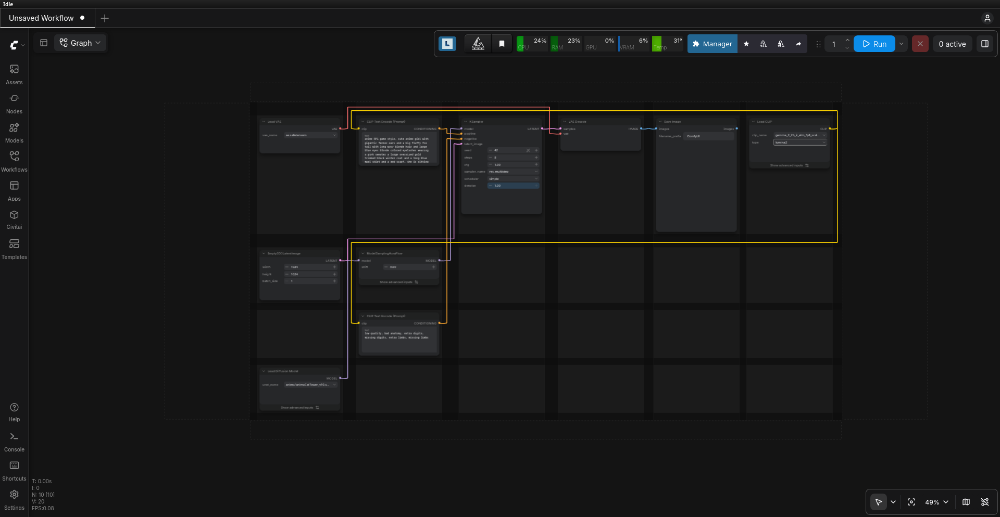

# ComfyUI-Manhattan

**Column/table layout for the ComfyUI graph — with Manhattan cable routing.**

Instead of free-form node placement, the canvas becomes a newspaper-style
table: content **columns** hold stacked, full-width nodes; dedicated cable
**gutters** between and around them carry every link as orthogonal (Manhattan)
traces — like a well-routed PCB, not a plate of spaghetti.



Purely client-side. No custom node types, no server code, no build step.

## Why your workflows stay safe

Everything Manhattan produces is **materialized into stock ComfyUI
primitives**:

- node positions and sizes are plain `pos` / `size`;
- cable routes are **native reroute points**, serialized into the workflow
  itself (`extra.reroutes`);
- the extension's own state rides in namespaced keys
  (`workflow.extra.gridcm`, `node.properties["gridcm.*"]`) that stock ComfyUI
  carries inertly.

Remove or disable the extension — every workflow made with it still opens
fully laid out, cables intact, and runs exactly the same.

## Install

```bash
cd ComfyUI/custom_nodes
git clone https://github.com/peko/ComfyUI-Manhattan.git
```

Reload the browser tab (Ctrl+Shift+R). Built and verified against ComfyUI
0.37.0 / frontend package 1.53.6, with Vue nodes (nodes v2) on or off.

## Use

**The `M` button** in the floating action bar (next to Run) is the main
switch:

- first click on a fresh workflow — **arranges** the graph into a grid
  (columns follow dataflow depth: loaders left, samplers midway, outputs
  right);
- afterwards it **toggles** Manhattan mode per workflow: *off* frees the
  nodes for ordinary editing (positions and cables stay), *on* snaps
  everything back to its remembered cell and re-routes the cables.

Arranging also switches the global *Link Render Mode* from Spline to Linear —
splines cut every gutter corner. Opt out in *Settings → GridCM*.

**Everything else is a drag:**

| gesture | effect |
|---|---|
| drag a node | target cell highlights; drop assigns the node there |
| drop onto an occupied cell | nodes stack; the drop *y* picks the slot — above the top node's centre lands on top, between two centres lands between |
| drop onto a dashed **ghost** column/row (always one per side) | splits outward: a fresh column/row is created |
| drag a **grip** above a vertical gutter | spreadsheet-style column resize, clamped at the widest node's natural width |
| collapse a node | the stack closes up around it; the collapsed title stretches to the column |

While a node is dragged its cables are released and rubber-band straight to
it, so you can see where they lead; the drop re-routes them. Every gesture —
arrange, drag, resize — is **a single undo step**.

**Node context menu** keeps the two things a drag cannot express: *Set
rowspan…* (tall nodes — previews — may span rows; the router treats the
covered gutter segments as obstacles) and *Exclude from grid*.

**Command palette**: `Grid: arrange graph into grid`, `reflow cables`,
`toggle for this workflow`, `set column width`, `stack selection into one
cell`.

## Settings (`Settings → GridCM`)

| setting | default | meaning |
|---|---|---|
| Grid layout features | on | master switch |
| Switch Link Render Mode to Linear on arrange | on | orthogonal traces need a non-spline mode |
| Cell padding | 10 px | cell border to its nodes |
| Gap between stacked nodes | 12 px | vertical spacing inside a stack |
| Minimum gutter size | 28 px | a gutter never collapses below this |
| Cable lane spacing | 14 px | centre-to-centre distance of parallel lanes |

## How it works

- **Grid model**: content columns C0..Cn with vertical gutters V0..Vn+1
  between and around them; content rows R0..Rm with horizontal gutters
  H0..Hm+1. The outer gutters always exist and are never blocked, so a route
  always has an escape channel. Row heights follow the HTML-table algorithm
  (span-1 cells set the minima, spanning cells pour their deficit into the
  last covered row).
- **Routing**: adjacent-column links travel vertically inside one V gutter;
  anything longer goes V(src+1) → cheapest unblocked horizontal channel →
  V(dst). Lanes are assigned by greedy interval coloring; gutters grow with
  their lane count. Links that pass through a **user-made** reroute are left
  untouched, and regeneration deletes exactly the plugin-owned points (an
  ownership map lives in `extra.gridcm.rerouteClaims`).
- **Width enforcement**: node width is pinned to its column by wrapping
  `computeSize` (this also defeats the frontend's load-time width inflation)
  and snapping the width back in `onResize`; height stays the user's.
- **Auto-layout**: longest-path layering over the dataflow (column = depth)
  plus barycenter ordering within columns. Manual placements are pins —
  re-arranging never shreds hand-tuning.

Internal namespace is `gridcm` (settings ids, `extra` key, property prefix) —
kept stable across the project's rename to Manhattan.

Module map: `model.js` (persisted schema) · `layout.js` (pure solver) ·
`topology.js` (layering + barycenter) · `enforce.js` (width pinning) ·
`reroutes.js` (Manhattan routing over native reroutes) · `paint.js` (bands,
ghosts, highlight, grips) · `drag.js` (pointer interception) · `index.js`
(commands, menus, lifecycle, the M button).

## Limitations (v1)

- Root graph only; subgraph interiors are untouched. Groups are ignored.
- Backward links (loops) route through the same formula without beautifying.
- Frontend-only Get/Set nodes carry no links in the graph JSON, so auto-layout
  places them as islands (column 0) — that's their job: cutting cables.
- Stale cables during a column-resize drag; they regenerate on release.

## License

MIT
